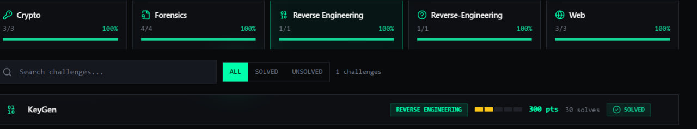
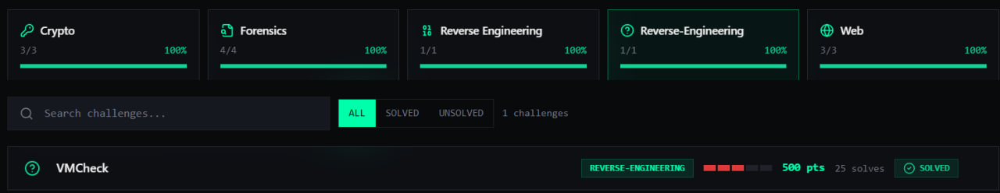

# Grand University CTF Solutions


**Rank:** 2nd Place  
**Solves:** 12/12 (100%)  
**CTF Date:** April 25, 2026

---

## Overall Progress


---

### 🔐 Crypto (3/3)


#### 1. C43SAR (100 pts) - Caesar Cipher

**Given:** `havpgs{e0g4g3_hag1y_1g_z4x3f_f3af3}`

**What I did:**

1. I looked at the ciphertext and noticed it had the format `xxxxx{...}` which looked like a flag.

2. The challenge name "C43SAR" looked like "CAESAR" with leet speak (4=A, 3=E), so I guessed it was a Caesar cipher.

3. I tried ROT13 on the first word `havpgs` and got `unictf` — that matched the flag format for this CTF.

4. So I applied ROT13 to all the letters in the ciphertext (A-Z becomes N-M, a-z becomes n-m).

5. The numbers inside stayed the same because they were already in leet format (0,3,4,1).

6. After decoding, I got `unictf{r0t4t3_unt1l_1t_m4k3s_s3ns3}`.

**PowerShell:**
```powershell
$text = "havpgs{e0g4g3_hag1y_1g_z4x3f_f3af3}"
$result = ""
foreach ($ch in $text.ToCharArray()) {
    if ($ch -ge 'a' -and $ch -le 'z') {
        $newChar = [char]((([int][char]$ch - 97 + 13) % 26) + 97)
        $result += $newChar
    } else {
        $result += $ch
    }
}
Write-Host $result
```
```
unictf{r0t4t3_unt1l_1t_m4k3s_s3ns3}
```

#### 2. 64ESAB (100 pts) - Base64

**Given:** `VjJ0YWFrMVhUa2RoTTNCV1lsUkdjMVJYZEhKa01XdDZZMFU1WVdGNlZuaFdWekZoVjIxV2MxTnFSbGhTUlRWUVZGVlZNVk5HVW5WVGJHeE9Za2QzZWxkVVNuZFVNREZ5VFVod1ZHRnRjems9`

**Solution:** Base64 decoded 4 times

**What I did:**

1. The challenge name "64ESAB" looked like "BASE64" spelled backwards, so I knew it was a Base64 challenge.

2. I tried decoding the given string once using Base64. It gave me another string that also looked like Base64.

3. I kept decoding again and again — each time the output still looked like Base64.

4. After decoding 4 times, I got a string that started with `unictf{` — that was the flag.

5. I decoded one more time just to be sure, and got the final flag.

```powershell
$text = "VjJ0YWFrMVhUa2RoTTNCV1lsUkdjMVJYZEhKa01XdDZZMFU1WVdGNlZuaFdWekZoVjIxV2MxTnFSbGhTUlRWUVZGVlZNVk5HVW5WVGJHeE9Za2QzZWxkVVNuZFVNREZ5VFVod1ZHRnRjems9"
while ($true) {
    $text = [System.Text.Encoding]::UTF8.GetString([System.Convert]::FromBase64String($text))
    Write-Host $text
    if (-not ($text -match '^[A-Za-z0-9+/=]+$')) { break }
}
```
Output
```
V2taak1XTkdhM3BWYlRGc1RXdHJkMWt6Y0U5YWF6VnhWVzFhV21Wc1NqRlhSRTVQVFVVMVNGUnVTbGxOYkd3eldUSndUMDFyTUhwVGFtczk=
WkZjMWNGa3pVbTFsTWtrd1kzcE9aazVxVW1aWmVsSjFXRE5PTUU1SFRuSllNbGwzWTJwT01rMHpTams9
ZFc1cFkzUm1lMkkwY3pOZk5qUmZZelJ1WDNOME5HTnJYMll3Y2pOMk0zSjk=
dW5pY3Rme2I0czNfNjRfYzRuX3N0NGNrX2YwcjN2M3J9
unictf{b4s3_64_c4n_st4ck_f0r3v3r}
```
so the flag is 
```
unictf{b4s3_64_c4n_st4ck_f0r3v3r}
```

#### 3. One Byte (200 pts) - Single XOR

**Given:** A file named `cipher.hex.txt` with this content: 
```
372c2b213624393a72301d3573362a1d722c711d203b36711d73311d357176293f
```

**What I did:**

1. First, I looked at the file contents. It was a long string of hex characters, numbers and letters from 0-9 and a-f.

2. I recognized this was likely a ciphertext encoded in hex, and since the challenge was called "One Byte", it probably meant the data was XORed with a single byte key.

3. I converted the hex string to raw bytes so I could work with it.

4. Then I brute forced all 256 possible single-byte keys (from 0 to 255). For each key, I XORed every byte and converted the result to text.

5. I filtered the output to only show results that contained "unictf" (the flag format for this CTF).

6. The correct result appeared with Key 66, giving me the flag.

**PowerShell command i used**
```powershell
$hex = "372c2b213624393a72301d3573362a1d722c711d203b36711d73311d357176293f"
$bytes = [byte[]]::new($hex.Length / 2)
for ($i = 0; $i -lt $hex.Length; $i += 2) {
    $bytes[$i / 2] = [Convert]::ToByte($hex.Substring($i, 2), 16)
}
0..255 | ForEach-Object {
    $key = $_
    $result = -join ($bytes | ForEach-Object { [char]($_ -bxor $key) })
    if ($result -match "unictf") { Write-Host "Key $key : $result" }
}
```
Flag: `unictf{x0r_w1th_0n3_byt3_1s_w34k}`

### 📌 Key Takeaways from Crypto Challenges

#### 1. C43SAR (Caesar Cipher)
- **Caesar ciphers** are simple letter shifts — easy to break with ROT13 or brute force.
- **Leet speak** (numbers replacing letters) is common in CTF flags — learn to recognize `0=o, 3=e, 4=a, 1=i/l, 5=s`.
- Look for patterns — the `{...}` format usually means it's a flag.

#### 2. 64ESAB (Base64)
- **Base64 encoding** is not encryption — it's just a way to represent binary data as text.
- If a string looks like random letters/numbers ending with `=` signs, it's likely Base64.
- Sometimes data is **encoded multiple times** — keep decoding until you see a flag.
- Challenge names often hint at the solution (64ESAB = BASE64 backwards).

#### 3. One Byte (Single XOR)
- **XOR with a single byte** is weak because there are only 256 possible keys.
- Always **brute force** all keys cause it's fast and easy.
- Look for readable text or flag formats (`unictf{`, `flag{`, etc.) in the output.
- Hex strings are often ciphertext — convert to bytes first before XOR.


### ⚙️ Reverse Engineering (2/2)



#### 8. KeyGen (300 pts)

**Given:** A file named `keygen.zip` containing a Linux executable called `keygen`

**What I did:**

1. **Extracted the zip file** — inside was a file named `keygen` (no extension). When I tried to double-click it on Windows, it said "unsupported", so I knew it was a Linux executable.

2. **Uploaded to Dogbolt** — I went to [dogbolt.org](https://dogbolt.org), an online decompiler that runs multiple decompilers at once. I uploaded the `keygen` binary there.

3. **Looked at the Hex-Rays output** — Dogbolt showed me the decompiled C code from Hex-Rays (a powerful decompiler). This made the binary readable without needing to install Ghidra or IDA locally.

4. **Analyzed the decompiled code** — Looking at the Hex-Rays output, I saw:
   - The program takes one command-line argument (a 33-character key)
   - It checks if the length is exactly 33 characters
   - It validates each character using a custom algorithm
   - A hardcoded array of 33 bytes was stored in the binary: `byte_100003F85`
   - The string `"OPF!"` was used in the calculation

5. **Understood the algorithm** — For each index `i` from 0 to 32:
   - First, it computes: `v4 = (("OPF!"[i % 4] + i) XOR key[i])`
   - Then it rotates `v4` left by 3 bits: `(v4 << 3) | (v4 >> 5)`
   - This result must equal the hardcoded byte at position `i`

6. **Reversed the algorithm** — To get the flag, I:
   - Reversed the rotate left (did a rotate right by 3 bits)
   - Then XORed with `("OPF!"[i % 4] + i)` to get each character of the key
   - The key turned out to be the flag

7. **Wrote a script** — I wrote a PowerShell script to reverse it automatically

   **Python script I used:**
```python
expected = [209, 249, 9, 58, 57, 153, 185, 210, 35, 121, 120, 10, 67, 16, 177, 32, 233, 192, 56, 32, 104, 178, 24, 170, 186, 216, 154, 27, 248, 226, 72, 155, 144]
opf = "OPF!"
flag = ""
for i in range(33):
    v4 = ((expected[i] >> 3) | ((expected[i] & 7) << 5)) & 0xFF
    flag += chr(v4 ^ (ord(opf[i % 4]) + i))
print(f"unictf{{{flag}}}")
```
Flag: `unictf{r3v_m3_b4by_0n3_m0r3_t1m3}` 

**PowerShell script to use instead of powershell:**
```powershell
$expected = @(209,249,9,58,57,153,185,210,35,121,120,10,67,16,177,32,233,192,56,32,104,178,24,170,186,216,154,27,248,226,72,155,144)
$opf = @(79,80,70,33)
$flag = ""
for ($i = 0; $i -lt 33; $i++) {
    # Reverse rotate left by 3 bits
    $v4 = (($expected[$i] -shr 3) -bor (($expected[$i] -band 7) -shl 5)) -band 0xFF
    # Reverse XOR
    $char = $v4 -bxor ($opf[$i % 4] + $i)
    $flag += [char]$char
}
Write-Host "unictf{$flag}"
```
Flag: `unictf{r3v_m3_b4by_0n3_m0r3_t1m3}` 


#### 9. VMCheck (500 pts) - Hard


**Given:** A file named `vmcheck.zip` containing a Linux executable called `vmcheck`

**What I did:**

1. This was the hardest Reverse Engineering challenge — only 25 solves. Solving it fast is what helped me jump to 2nd place.

2. I extracted the zip and got a file named `vmcheck`. When I tried to run it on Windows, it said "unsupported"  so it was a Linux executable.

3. I uploaded the binary to **Dogbolt** (online decompiler) and looked at the Hex-Rays output.

4. Looking at the decompiled code, I saw:
   - The program runs a custom bytecode interpreter (a virtual machine)
   - My input gets processed through this VM
   - A hardcoded array of 38 bytes (`byte_100003F24`) was the expected output

5. I extracted the expected bytes from the decompiled code:

6.Instead of emulating the whole VM, I reversed the algorithm mathematically:
-The VM rotated left by 3 bits → I rotated right by 3 bits
-It XORed with i * 13 → I XORed with i * 13 again
-It added i → I subtracted i
-It XORed with 90 → I XORed with 90 again
7. I wrote a Python script to reverse it:
```
expected = [121, 193, 121, 216, 48, 0, 75, 73, 162, 18, 143, 229, 85, 228, 14, 247, 
            77, 39, 142, 127, 52, 97, 11, 185, 245, 80, 136, 214, 106, 241, 6, 208, 
            239, 39, 81, 236, 204, 109]

def rotr(val, bits, size=8):
    bits = bits % size
    return ((val >> bits) | (val << (size - bits))) & ((1 << size) - 1)

flag_chars = []
for i in range(38):
    temp1 = rotr(expected[i], 3)
    temp2 = temp1 ^ (i * 13)
    temp3 = temp2 - i
    flag_char = temp3 ^ 90
    flag_chars.append(chr(flag_char & 0xFF))

flag = ''.join(flag_chars)
print(f"unictf{{{flag}}}")
```
